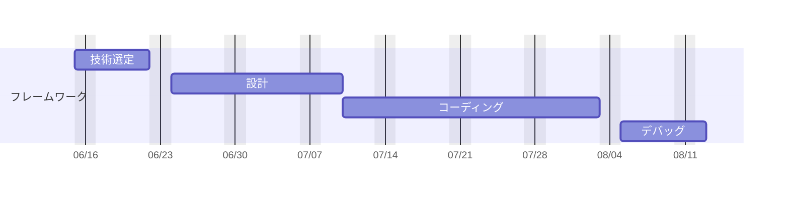
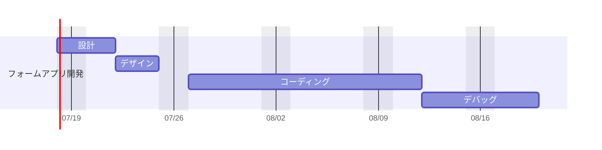

# これは？

Webアプリを作っていくための白紙ページ

## 開発ガントチャート





## 試験稼働

```
git clone https://github.com/miatia1025/firstReact
cd firstReact
npm install
npm start
```

## 開発者

```
git clone https://github.com/miatia1025/firstReact
cd firstReact
npm install
code .
```
